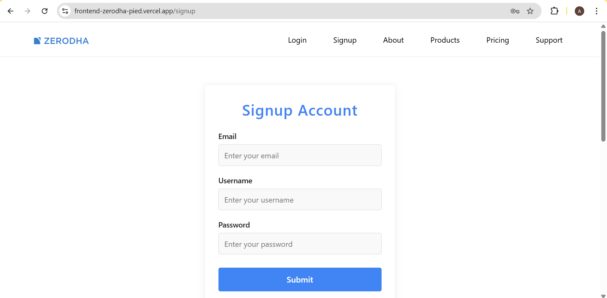

# My Zerodha Clone

A full-stack trading platform inspired by Zerodha, built with the MERN stack. This project is organized as a monorepo with three main folders:
- `backend/` (Node.js/Express, MongoDB Atlas)
- `frontend/` (React, user authentication, landing pages)
- `dashboard/` (React, user dashboard, real-time trading simulation)

---

## Table of Contents
- [Features](#features)
- [Tech Stack](#tech-stack)
- [Project Structure](#project-structure)
- [Setup & Installation](#setup--installation)
- [Functionality Overview](#functionality-overview)
- [Deployment](#deployment)
- [Screenshots](#screenshots)
- [License](#license)

---

## Features
- User signup and login with JWT authentication
- Secure password hashing (bcrypt)
- MongoDB Atlas for cloud database
- Responsive landing page and dashboard
- Real-time order placement (buy/sell)
- Holdings, positions, funds, and watchlist management
- Data visualization with charts (Chart.js)
- Protected dashboard route (only logged-in users)
- Context API for global state management
- Error handling and toast notifications

---

## Tech Stack
- **Frontend:** React, React Router, Axios, React Toastify, Chart.js
- **Dashboard:** React, React Router, Axios, Chart.js, Material UI Icons
- **Backend:** Node.js, Express, Mongoose, bcryptjs, jsonwebtoken, cookie-parser, cors
- **Database:** MongoDB Atlas (cloud)

---

## Project Structure
```
my-zerodha/
  backend/      # Node.js/Express API, MongoDB models, authentication
  frontend/     # React app for landing, signup, login
  dashboard/    # React app for user dashboard, trading, charts
```

---

## Setup & Installation
1. **Clone the repo:**
   ```sh
   git clone https://github.com/your-username/my-zerodha.git
   cd my-zerodha
   ```
2. **Install dependencies:**
   ```sh
   cd backend && npm install
   cd ../frontend && npm install
   cd ../dashboard && npm install
   ```
3. **Configure environment variables:**
   - In `backend/.env`, set your MongoDB Atlas URI, JWT secret, and port.
   - Example:
     ```
     MONGO_URL=your-mongodb-atlas-uri
     PORT=3002
     TOKEN_KEY=your-secret-key
     ```
4. **Run the apps (in separate terminals):**
   ```sh
   cd backend && npm start
   cd frontend && npm start
   cd dashboard && npm start
   ```

---

## Functionality Overview

### Backend (`backend/`)
- **User Authentication:** Signup/login with JWT, password hashing, and cookies.
- **Models:** User, Holdings, Positions, Orders (with schemas for each).
- **Order Endpoints:**
  - `POST /newOrder` — Place a buy/sell order
  - `GET /orders` — Get all orders (real-time updates)
- **CORS:** Configured for secure cross-origin requests.

### Frontend (`frontend/`)
- **Landing Page:** Modern, responsive design with React and custom CSS.
- **Signup/Login:** Forms with validation, error/success toasts, and API integration.
- **Protected Routes:** Dashboard access only for authenticated users (token in localStorage).
- **Routing:** React Router for navigation.

### Dashboard (`dashboard/`)
- **User Dashboard:**
  - Holdings, Positions, Orders, Funds, Apps, Watchlist
  - Real-time order updates (polling every 5 seconds)
  - Buy/Sell action windows (context-driven modals)
  - Data visualization with Doughnut and Vertical charts
  - Material UI icons and tooltips
- **User Info:** Username and initials shown in menu/profile (decoded from JWT)
- **Context API:** For managing buy/sell modals and global state

---

## Deployment
- Deploy backend first (Render, Railway, Heroku, etc.)
- Update frontend/dashboard API URLs to point to deployed backend
- Deploy frontend and dashboard (Vercel, Netlify, etc.)
- Use environment variables for all secrets and URLs

### Live Demo
- **Frontend:** [https://frontend-zerodha-pied.vercel.app](https://frontend-zerodha-pied.vercel.app)
- **Dashboard:** [https://my-kite-by-zerodha-dashboard.vercel.app](https://my-kite-by-zerodha-dashboard.vercel.app)
- **Backend API:** [https://zerodha-backend-6fvx.onrender.com](https://zerodha-backend-6fvx.onrender.com)

---

## Screenshots


### Dashboard


### Login


### SignUp


### Charts


---

## License
This project is for educational/demo purposes only. Not for production trading use.
